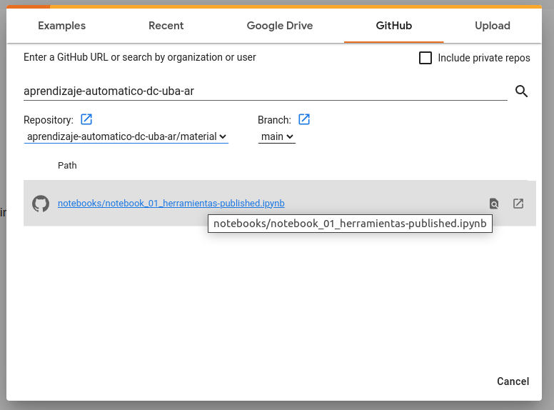

# Repositorio de _Notebooks_

Materia: Aprendizaje Automático

Dictado por el [Dpto. de Computación](https://www.dc.uba.ar/) - [Facultad de Ciencias Exactas y Naturales](https://exactas.uba.ar/) - [Universidad de Buenos Aires](https://uba.ar/)

El material de este repositorio forma parte del curso en su edición 2C de 2024.

## Google Colab

Para abrir una notebook de este repositorio se puede:

1. Desde Google Colab en el menú `File` -> `Upload notebook`. En la ventana seleccionar la pestaña `GitHub` y ahí completar del proyecto (`aprendizaje-automatico-dc-uba-ar`) y repositorio (`aprendizaje-automatico-dc-uba-ar/material`) de este repositorio para que se listen las notebooks de este repositorio. Ver imagen: 

	

1. Completar la URL de [Google Colab](https://colab.research.google.com/) con la url de la notebook agregada atrás. 

	Ej. [`https://colab.research.google.com/github/aprendizaje-automatico-dc-uba-ar/material/blob/main/notebooks/notebook_01_herramientas-published.ipynb`](https://colab.research.google.com/github/aprendizaje-automatico-dc-uba-ar/material/blob/main/notebooks/notebook_01_herramientas-published.ipynb).

